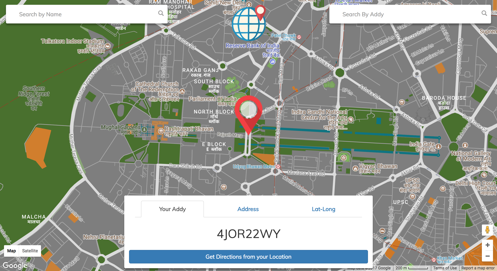

# </img>   Addy
Addy is a web app that enhances the addressing system of the world. Instead of remembering long addresses, Addy generates a unique 7-alphanumeric code based on the latitudinal and longitudinal coordinates of any position. The code is so accurate that every building in the world has been assigned a different 'Addy' with a minimum distance of 11.132 meters.




**Tech Stack for this project**
- HTML5
- CSS3
- JavaScript
- Docker
- docker-compose
- Gulp
- BootStrap 3
- Google Maps Places API
- Google Maps Geocoder API Used

## Gitter channel link
https://gitter.im/Addy-Smart-Addresses

## Contribution Guidelines
https://github.com/Addy-Smart-Addresses/Addy/wiki/Contribution-Guidelines

## Getting Started with Contributing:
1. After forking the project, git clone this repository onto your local environment:
```bash
git clone https://github.com/bluetch/shopee_design.git
```
2. Create a separate Git branch
```bash
git branch <your_new_branch_name>
```
3. Git checkout your branch
```bash
git checkout <your_new_branch_name>
```
4. Open up the project in your favorite code editor (e.g. Atom).
5. Make your changes.
6. Git add and commit your changes.
```bash
git add <file_name>
git commit -m <insert_commit_comment>
```
7. Git push your changes as well as your new branch.
```bash
git push -u origin <your_branch_name>
```
8. Go to the GitHub repository and submit a Pull Request.

## Running

Once you have [docker](https://docs.docker.com/engine/installation/) and [docker-compose](https://docs.docker.com/compose/install/) installed:

    docker-compose up --build
    
A development version will be running at port 8000 and a simulation of production build at port 8001.
